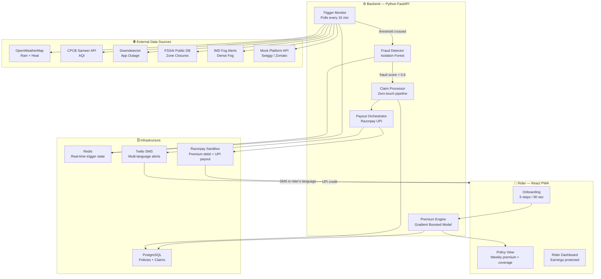
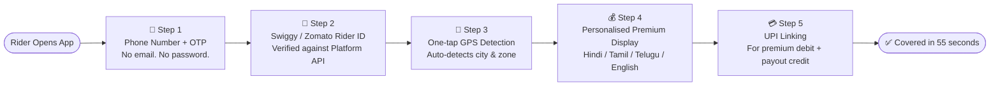
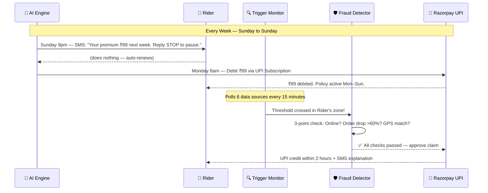
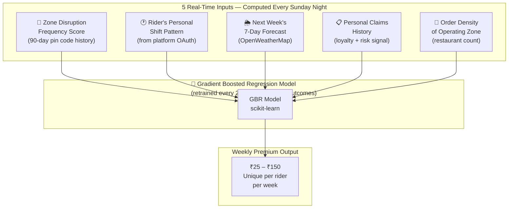
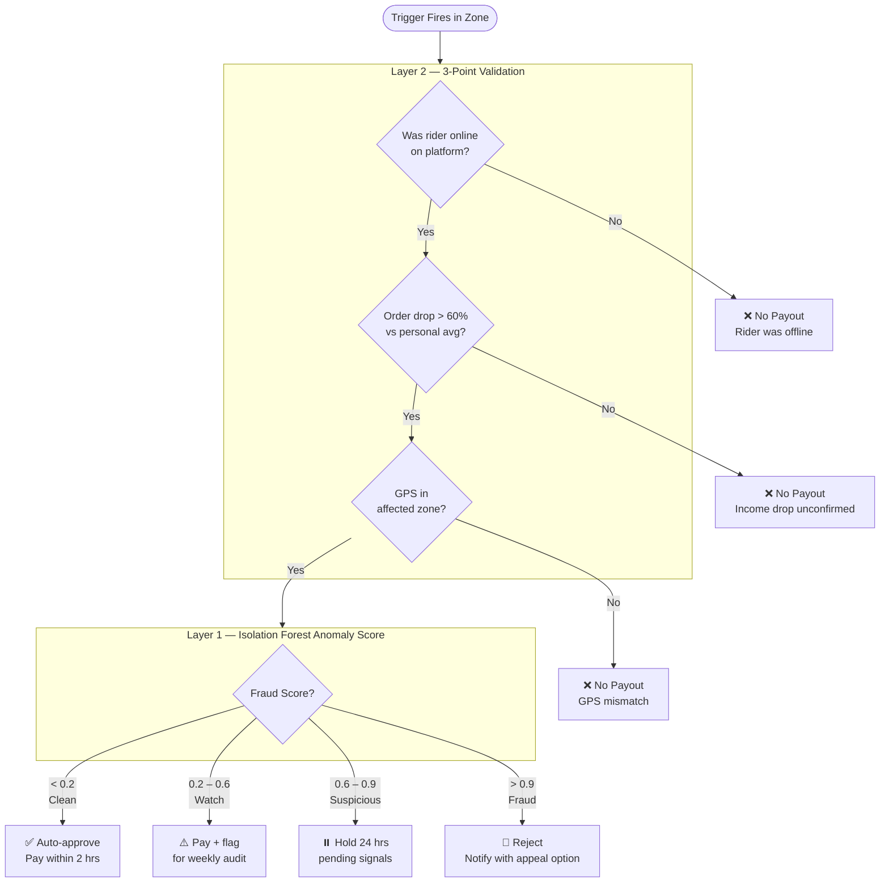
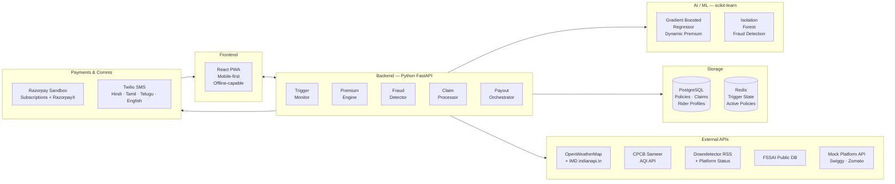
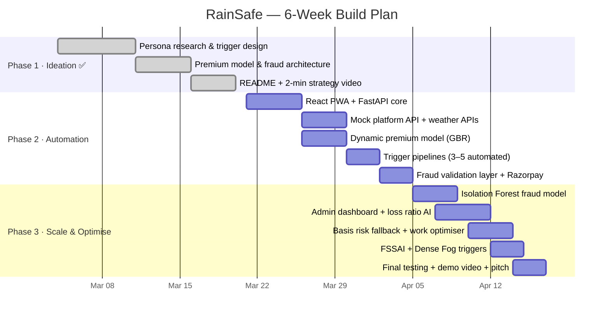

# 🌧️ RainSafe
### AI-Powered Parametric Income Insurance for India's Food Delivery Riders

> *When rain stops a Swiggy rider from working, they lose their entire day's income.  
> We detect that disruption automatically and credit their UPI account within 2 hours.  
> **No forms. No waiting. No rejection. Just protection.***

**Guidewire DEVTrails 2026 — University Hackathon | Phase 1 Submission**

---

## System Architecture Overview

---

## Table of Contents

1. [The Problem](#1-the-problem)
2. [Our Persona](#2-our-persona)
3. [Application Workflow](#3-application-workflow)
4. [Weekly Premium Model](#4-weekly-premium-model)
5. [Parametric Triggers](#5-parametric-triggers)
6. [AI/ML Integration](#6-aiml-integration)
7. [Fraud Detection Architecture](#7-fraud-detection-architecture)
8. [Payout Processing](#8-payout-processing)
9. [Platform Choice — Web vs Mobile](#9-platform-choice--web-vs-mobile)
10. [Tech Stack](#10-tech-stack)
11. [Development Plan](#11-development-plan)
12. [What Makes RainSafe Unique](#12-what-makes-rainsafe-unique)

---

## 1. The Problem

India has over **15 lakh active food delivery riders** working for Zomato and Swiggy every month. When an external disruption hits — a monsoon downpour, a 47°C heatwave, a citywide platform outage — they lose their **entire day's income**. Not reduced income. Zero income.

The income loss is binary. Research from the Institute of Economic Growth, Delhi confirms that when temperature crosses a safety threshold, it means zero earnings on that day. And according to NITI Aayog 2024, **90% of gig workers in India have zero savings** to absorb even a single day of lost earnings.

Disruptions cause gig workers to lose **20–30% of their monthly income**. When they occur, workers bear the full financial loss with no safety net.

### Why Existing Solutions Fail

| Existing Solution | What It Covers | What It Misses |
|---|---|---|
| Zomato Insurance | Accident + medical | Weather income loss |
| Swiggy Tiered Insurance | Health (tied to performance rating) | Rain, heat, AQI, outage |
| PM-JAY Government Scheme | Health up to ₹5 lakh | Lost daily wages |
| SEWA Parametric Insurance | Heat for farm workers | Delivery riders; 6–8 week payout |
| **RainSafe** | **Income loss from 6 triggers** | **Everything the others miss** |

> **Coverage Scope (Critical Constraint Met):** RainSafe covers **loss of income only**. We strictly exclude health, life, accident, and vehicle repair coverage in line with the hackathon constraints.

---

## 2. Our Persona

**Chosen Segment: Food Delivery Riders on Zomato and Swiggy**

This was not an arbitrary choice. Food delivery riders are the only gig workers where:
- Bad weather is **always** bad news — rain increases cab bookings via surge pricing, but kills food delivery orders entirely
- Income loss is **app-verifiable** — the Swiggy/Zomato app records every idle minute, so we never rely on self-reporting
- The disruption signal is **unambiguous** — unlike Q-commerce riders who receive surge bonuses during rain, Swiggy riders earn nothing

### Rider Financial Profile

| Metric | Value |
|---|---|
| Monthly income | ₹15,000 – ₹45,000 |
| Weekly income | ₹3,500 – ₹11,000 |
| Income on a disruption day | ₹0 – ₹400 (effectively zero) |
| Monthly loss from disruptions | ₹3,000 – ₹15,000 (20–30% of total earnings) |
| Our weekly premium range | ₹25 – ₹150 (dynamically calculated) |
| Premium as % of income | 0.5% – 1.7% — less than the cost of one meal |

### Persona Scenario — Ravi Kumar, Swiggy Rider, Chennai

Ravi is a Swiggy food delivery partner in Tambaram, Chennai. He has been delivering for 2 years. He earns approximately ₹22,000/month. During the Chennai monsoon (October–December), he loses income on 8–12 days due to heavy rain. That is ₹4,000–₹8,000 in unprotected lost earnings every monsoon season. RainSafe costs him approximately ₹89/week — and pays him ₹600 every day it rains past the threshold.

---

## 3. Application Workflow

### 3.1 Onboarding — 5 Steps, Under 90 Seconds

Our onboarding requires no English literacy, no documents, and works on any 4G Android phone. It is designed to feel identical to signing up for PhonePe or Hotstar.

**Scenario — Ravi's onboarding:**
Ravi opens RainSafe. Enters his phone number and OTP. Types his Swiggy rider ID. Taps Allow for GPS — the app detects Tambaram, Chennai automatically. Sees: *"Your premium this week: ₹67. Covers: Heavy rain, Extreme heat, AQI hazard, App outage, Restaurant zone closure, Dense fog."* Taps Link UPI, selects his PhonePe UPI. Done. Total time: **55 seconds.**

### 3.2 Weekly Policy Flow

### 3.3 Claim Flow — Zero Touch

The rider **never files a claim.** The rider **never opens the app** during a disruption. The money simply arrives with an SMS explaining exactly what happened.

---

## 4. Weekly Premium Model

> **Weekly Pricing Constraint Met:** All premiums and payouts are structured on a strictly weekly basis (Monday–Sunday), aligned with the typical gig worker earnings cycle.

### How It Works

Every Sunday night, a unique premium is calculated for each rider based on **5 real-time inputs** fed into a gradient boosted regression model. No fixed tiers. No flat rates. A rider in flood-prone Tambaram in monsoon season pays a genuinely different premium than a rider in central Bengaluru in January — because their actual risk is different.

### The 5 Premium Inputs

### Premium Example — Two Riders, Same City, Different Risk

| | Priya Kumar | Rohan Mehta |
|---|---|---|
| Zone | Andheri West, Mumbai | Bandra, Mumbai |
| Shift | 11am – 4pm (peak rain hours) | 6pm – 11pm |
| Zone rain risk | High (6 flood events in 90 days) | Low (2 flood events in 90 days) |
| Forecast | 3 rain days predicted | 1 rain day predicted |
| Weekly Premium | **₹118** | **₹44** |

### Weekly Policy Structure

- **Coverage period:** Monday 00:00 to Sunday 23:59
- **Premium range:** ₹25 – ₹150/week
- **Maximum weekly payout:** Capped at 5 days to protect pool sustainability
- **Auto-renewal:** Every Monday via Razorpay Subscription UPI auto-debit
- **Pause option:** Rider can reply STOP before Sunday midnight to skip a week

---

## 5. Parametric Triggers

We insure **income lost**, not the cost of external events. Six triggers cover the full range of disruptions that cause verifiable income loss for food delivery riders.

| Trigger | Threshold | Data Source | Payout (Basic Plan) | Payout (Full Plan) |
|---|---|---|---|---|
| 🌧️ Heavy Rain | ≥ 64.5 mm/day | IMD / OpenWeatherMap | ₹300/day | ₹600/day |
| 🌡️ Extreme Heat | ≥ 45°C or Heat Index ≥ 41°C for 2hrs | IMD Heatwave Alert | ₹400/day | ₹700/day |
| 😷 AQI Hazard | AQI ≥ 300 (Very Poor) | CPCB Sameer API | — | ₹400/day |
| 📱 Platform Outage | App down ≥ 30 mins | Downdetector + Status Page | ₹300/day | ₹500/day |
| 🏪 FSSAI Zone Closure | Mass restaurant closure in rider's pin code | FSSAI Public DB | — | ₹400/day |
| 🌫️ Dense Fog | Visibility < 50m | IMD Fog Alert (North India, Nov–Feb) | — | ₹300/day |

### Trigger Scenarios

**Heavy Rain — Mumbai Monsoon:**
August 14, 3:15pm. IMD records 78mm rainfall in Andheri West. System detects via OpenWeatherMap at 3:30pm. Rider Priya was active on Swiggy — her normal 3pm–6pm count is 9 orders. Today: 2 orders (78% drop). GPS confirms Andheri West. Fraud check passes. **3:48pm: ₹600 credited. Priya was sheltering from rain when the money arrived.**

**FSSAI Zone Closure — Hyderabad (Our Unique Trigger):**
A Tuesday afternoon — clear weather, no other disruptions. FSSAI inspection team seals 11 restaurants in Kondapur. Rider Venkat Rao operates primarily in that zone. Between 2pm–5pm he received only 1 order — an 88% drop. GPS confirms Kondapur. Zero weather events. Platform working normally. System identifies FSSAI zone disruption. **4:30pm: ₹400 credited. The only insurance product in the world that paid for this.**

**Platform App Outage — Nationwide AWS Failure:**
Documented Swiggy outage — 85–88% of users reported app issues. Downdetector registers spike at 7:42pm. Our system detects at 7:45pm. Outage persists 47 minutes (exceeds 30-min threshold). 1,247 eligible subscribers identified. Platform activity confirms zero orders during window — impossible to fake. **8:34pm: ₹3.74 lakh disbursed to 1,247 riders with zero human review.**

---

## 6. AI/ML Integration

### 6.1 Dynamic Premium Calculation — Gradient Boosted Regression

A gradient boosted regression model (scikit-learn `GradientBoostingRegressor`) is trained on historical disruption data and payout outcomes. It takes the 5 inputs described in Section 4 and outputs a weekly premium between ₹25 and ₹150. The model is retrained every two weeks on real payout outcomes, making it a continuously self-improving pricing engine.

The loss ratio on the admin dashboard acts as the live validation metric:
- Loss ratio 0.60–0.80 → model performing well, premiums maintained
- Loss ratio > 0.80 → model automatically increases next week's premiums in affected zones
- Loss ratio < 0.50 → model decreases premiums to stay competitive

This is a **self-correcting AI system** — it learns from its own payout outcomes and adjusts in real time.

### 6.2 Fraud Detection — Isolation Forest

An `IsolationForest` anomaly detection model builds a personal behavioral baseline for each rider over their first 4 weeks:
- Typical online hours
- Average orders per hour by time-of-day and day-of-week
- Typical GPS movement patterns
- Operating zone history

Every payout request is scored with a **fraud probability score (0–1)**:

| Score Range | Action |
|---|---|
| < 0.2 | Auto-approve, pay within 2 hours |
| 0.2 – 0.6 | Pay, flag for weekly audit |
| 0.6 – 0.9 | Hold 24 hours pending additional signals |
| > 0.9 | Reject, notify rider with appeal option |

### 6.3 Basis Risk Fallback Detection

The fundamental weakness of parametric insurance is **basis risk** — a trigger not formally detected but income loss actually occurred. We solve this with an AI-based fallback layer:

The system continuously compares **expected earnings** (based on 30-day history) against **actual platform earnings**. If a significant weekly drop is detected without any formal trigger firing, the system:
1. Flags a potential missed payout
2. Runs the standard 3-point verification (GPS match, order drop, nearby rider comparison)
3. If valid, triggers a payout automatically

No existing parametric product addresses basis risk. We do.

### 6.4 Work Optimisation — Beyond Insurance

Using shift pattern data, zone demand patterns, and disruption forecasts, the system surfaces **proactive earnings suggestions** in plain language in the rider's preferred language:

> *"Best time to work tomorrow: 6 PM – 9 PM. High order demand expected in your zone."*  
> *"Heavy rain expected 2–5 PM tomorrow. Consider avoiding this slot. You are covered if it affects your earnings."*

This transforms RainSafe from a reactive insurance product into an **intelligent income assistant**.

---

## 7. Fraud Detection Architecture

Fraud in parametric insurance is different from traditional insurance. Fraudsters do not file fake claims — they try to fake eligibility when a real trigger fires. Our detection has 4 layers:

**Layer 1 — Behavioral Anomaly Detection (Isolation Forest)**
Baseline built over first 4 weeks. Every payout request scored against personal history. (See Section 6.2)

**Layer 2 — 3-Point Location and Activity Validation**
All three must pass for payout approval:
1. Rider was **online on the platform** during the trigger window (not already offline)
2. Order count during trigger window dropped **below 40% of personal 30-day average** for that time slot
3. Last known **GPS confirms presence in the affected zone**

**Layer 3 — Duplicate Claim Prevention**
- One Swiggy/Zomato Rider ID = one account
- UPI ID verified as **Aadhaar-linked** → one Aadhaar = one account system-wide
- **Device fingerprinting** at onboarding → two accounts from same hardware device = both flagged and frozen

**Layer 4 — Temporal Pattern Monitoring**
Claims at unusual hours, sudden subscription reactivation immediately before a known trigger event, and claim frequency spikes across a zone are all flagged for audit.

**Edge Case — Shared Address, Multiple Riders:**
Four riders from the same apartment in Hyderabad all claim on a rain day. Looks like syndicate fraud. Our system checks each Swiggy rider ID has 6+ months of delivery history and individual platform data confirms each saw independent order drops. **All four get paid.** Shared housing is not fraud. Four accounts with 2-week histories and no delivery history → all four flagged and held.

---

## 8. Payout Processing

### Pipeline: Trigger to UPI Credit

```mermaid
gantt
    title Trigger → UPI Credit Pipeline (vs Industry Standard)
    dateFormat  mm
    axisFormat  T+%M min

    section RainSafe
    Threshold detected (15-min poll)       :milestone, m1, 00, 0m
    Identify subscribers in zone           :a1, 00, 15m
    3-point fraud check (parallel)         :a2, 15, 5m
    Claim approved & sent to Razorpay      :a3, 20, 5m
    UPI credit confirmed                   :a4, 25, 5m
    SMS sent to rider                      :milestone, m2, 30, 0m

    section Industry Standard (SEWA)
    Manual claim processing begins         :crit, b1, 00, 30m
    "6 to 8 weeks later..."                :crit, b2, 30, 30m
```

**Maximum total time: under 2 hours 15 minutes from disruption start**
**Industry comparison (SEWA): 6–8 weeks**

### Payout SMS Transparency

Every payout SMS includes a plain-language explanation:
> *"RainSafe: ₹600 credited. Reason: Rainfall 78mm (threshold: 64.5mm). Your orders dropped 72% in your zone between 3 PM – 6 PM. Payout auto-approved. Check your UPI."*

Riders always know precisely what happened and why they were paid — reducing disputes and building long-term trust.

### Smart Premium Autopay Control

Every Sunday the rider receives their coming week's premium. They set a **maximum autopay limit** (e.g., ₹70). If premium ≤ limit: auto-debit. If premium > limit: rider confirmation required. Automation maintained, financial control respected.

---

## 9. Platform Choice — Web vs Mobile

**Choice: React Progressive Web App (PWA)**

| Factor | Reasoning |
|---|---|
| No app store needed | Riders install via browser — no Play Store friction |
| Works offline | Service Worker caches key screens for low-connectivity moments |
| Works on any Android | No minimum OS version requirement |
| Identical UX to native app | PWA on Android is indistinguishable from an installed app |
| Faster to build and deploy | Single codebase for all platforms |

Our target users already have PhonePe and Hotstar installed — both of which offer PWA-like experiences. The onboarding flow is designed to feel identical to these trusted apps.

---

## 10. Tech Stack

| Layer | Technology | Reason |
|---|---|---|
| **Frontend** | React PWA | Mobile-first, offline-capable, no app store |
| **Backend** | Python FastAPI | Handles trigger monitoring, fraud detection, premium calculation, payout orchestration |
| **AI/ML** | scikit-learn (GradientBoostingRegressor + IsolationForest) | Premium model + fraud anomaly detection |
| **Database** | PostgreSQL | Rider profiles, policy records, claim history |
| **Cache** | Redis | Real-time trigger state, active policy lookup |
| **Weather API** | OpenWeatherMap (free tier) + indianapi.in IMD wrapper | Rain, temperature, 7-day forecast |
| **AQI API** | CPCB Sameer API via data.gov.in | Official government AQI data, free |
| **Platform Data** | Mock API (FastAPI) simulating Swiggy/Zomato rider activity | Problem statement permits simulated platform APIs |
| **Outage Detection** | Downdetector RSS + official platform status page polling | Platform outage trigger |
| **FSSAI Data** | FSSAI public food business operator database | Open government data for zone closure trigger |
| **Payments** | Razorpay Sandbox (Subscriptions + RazorpayX Payouts) | Weekly premium debit + instant UPI disbursement |
| **Notifications** | Twilio SMS (free tier) | Multi-language SMS in Hindi, Tamil, Telugu, English |
| **Hosting** | Render (free tier) | Demo deployment |

---

## 11. Development Plan

### Phase 1 — Ideation & Foundation (March 4–20) ✅ *Current Phase*
- [x] Persona research and selection (food delivery riders — Zomato/Swiggy)
- [x] Define 6 parametric triggers with thresholds, data sources, and payout amounts
- [x] Design 5-step onboarding flow
- [x] Design weekly premium model with 5 AI inputs
- [x] Design fraud detection architecture (4 layers)
- [x] Define full application workflow and payout pipeline
- [x] Select tech stack
- [x] This README and 2-minute strategy video

### Phase 2 — Automation & Protection (March 21 – April 4)
- [ ] Build React PWA frontend (onboarding, policy view, rider dashboard)
- [ ] Build Python FastAPI backend (core API endpoints)
- [ ] Implement mock Swiggy/Zomato platform API
- [ ] Implement OpenWeatherMap + CPCB Sameer API integrations
- [ ] Build dynamic premium calculation (gradient boosted model with mock training data)
- [ ] Build 3–5 automated trigger detection pipelines
- [ ] Build 3-point fraud validation layer
- [ ] Integrate Razorpay Sandbox for premium debit and UPI payout
- [ ] Build zero-touch claim pipeline (trigger → fraud check → payout)
- [ ] 2-minute demo video

### Phase 3 — Scale & Optimise (April 5–17)
- [ ] Train and integrate Isolation Forest fraud anomaly model
- [ ] Build admin/insurer dashboard (loss ratio, predictive analytics, fraud audit queue)
- [ ] Add basis risk fallback detection layer
- [ ] Add work optimisation AI suggestions for riders
- [ ] Add predictive disruption alerts (7-day forecast-based SMS)
- [ ] Add FSSAI zone closure trigger
- [ ] Add Dense Fog trigger (North India seasonal)
- [ ] Add Twilio multi-language SMS notifications
- [ ] Final integration testing and demo preparation
- [ ] 5-minute walkthrough demo video + Final pitch deck

---

## 12. What Makes RainSafe Unique

### 1. The FSSAI Trigger — Never Been Done Before
No insurance product anywhere in the world covers income loss caused by a government food safety raid closing restaurants in a rider's zone. The data is publicly available. It is perfectly parametric. SEWA's researchers called for expansion to new trigger types — we answered with a trigger they never imagined.

### 2. Platform App Outage as a Parametric Trigger
When Zomato or Swiggy goes down due to an AWS failure, every active rider earns zero. No insurer on earth covers platform outage for gig workers. Our fraud detection for this trigger is the simplest of all six — if the platform confirms downtime and the rider was logged in, payout is automatic.

### 3. Truly Dynamic Premium — Not a Tier With a Label
Every other solution uses 2–3 fixed tiers. We calculate a unique weekly premium for every single rider based on 5 real-time inputs. Two riders in the same city can pay ₹44 and ₹118 in the same week because their actual risk profiles are genuinely different. This is a trained model retrained every two weeks on real payout outcomes.

### 4. 2-Hour Payout vs 6-Week Industry Standard
SEWA — the world's most successful parametric insurance for Indian informal workers — takes 6–8 weeks to pay out. We pay in under 2 hours. For a rider who lost ₹700 on a rain day and needs petrol money to get home, 6 weeks is not insurance. It is a historical footnote.

### 5. Financial Independence from the Platform
Swiggy's insurance is tied to a performance rating. Bronze-tier riders get accident-only. We are completely independent of the delivery platform. When 150 Blinkit riders were blocked from the app for protesting in 43°C heat, they lost both their income and their insurance simultaneously. With RainSafe, a rider who refuses unsafe work or gets blocked by the platform still has their income protection intact — **because we are not Swiggy.**

### 6. Basis Risk Solved — No Parametric Product Does This
We detect income loss even when no formal trigger fires, using AI comparison of expected vs. actual earnings. This eliminates the fundamental structural weakness of parametric insurance.

---

## Coverage Scope — Hackathon Constraint Compliance

| Constraint | Status |
|---|---|
| ✅ Weekly pricing model | All premiums calculated and charged weekly (Monday–Sunday) |
| ✅ Income loss coverage only | Pays for lost wages only — no health, life, accident, or vehicle repair payouts |
| ✅ Delivery partner persona | Food delivery riders (Zomato/Swiggy) — a specific sub-category |
| ✅ Parametric automation | 6 triggers with real-time monitoring, auto-claim initiation, instant payout |
| ✅ AI/ML integration | Dynamic premium (GBR model) + fraud detection (Isolation Forest) + basis risk fallback |
| ✅ Fraud detection | 4-layer system: anomaly detection, location/activity validation, duplicate prevention, temporal monitoring |
| ✅ Mock APIs acceptable | OpenWeatherMap (free), CPCB (free), platform activity (mock), Razorpay (sandbox) |

---

*RainSafe — Guidewire DEVTrails 2026 — University Hackathon*  
*Phase 1 Submission | March 2026*
