# ⚡ EarnSecure
### AI-Powered Parametric Income Insurance for India's Food Delivery Riders

> *When rain stops a Swiggy rider from working, they lose their entire day's income.*
> *We detect that disruption automatically and credit their UPI account within 2 hours.*
> **No forms. No waiting. No rejection. Just protection.**

**Guidewire DEVTrails 2026 — University Hackathon | Phase 1 Submission**

---

## System Architecture Overview

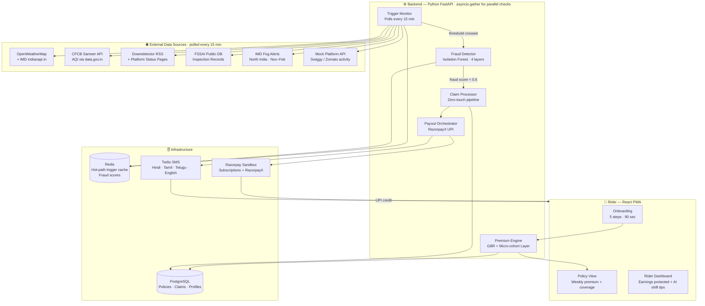

---

## Table of Contents

1. [The Problem](#1-the-problem)
2. [Our Persona](#2-our-persona)
3. [Application Workflow](#3-application-workflow)
4. [Weekly Premium Model](#4-weekly-premium-model)
5. [Micro-Cohort Actuarial Pricing](#5-micro-cohort-actuarial-pricing)
6. [Parametric Triggers](#6-parametric-triggers)
7. [AI/ML Integration](#7-aiml-integration)
8. [Fraud Detection Architecture](#8-fraud-detection-architecture)
9. [Payout Processing](#9-payout-processing)
10. [Analytics Dashboards](#10-analytics-dashboards)
11. [IRDAI Regulatory Compliance](#11-irdai-regulatory-compliance)
12. [Competitive Landscape](#12-competitive-landscape)
13. [Platform Choice — Web vs Mobile](#13-platform-choice--web-vs-mobile)
14. [Tech Stack](#14-tech-stack)
15. [Development Plan](#15-development-plan)
16. [What Makes EarnSecure Unique](#16-what-makes-earnsecure-unique)

---

## 1. The Problem

India has over **15 lakh active food delivery riders** working for Zomato and Swiggy every month. When an external disruption hits — a monsoon downpour, a 47°C heatwave, a citywide platform outage — they lose their **entire day's income**. Not reduced income. Zero.

The income loss is binary. Research from the Institute of Economic Growth, Delhi confirms that when temperature crosses a safety threshold, riders earn zero on that day. According to NITI Aayog 2024, **90% of gig workers in India have zero savings** to absorb even a single lost day.

Disruptions cause gig workers to lose **20–30% of their monthly income**. They bear the full financial loss with no safety net.

### Why Existing Solutions Fail

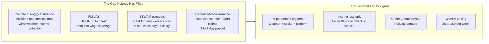

> **Coverage Scope (Critical Constraint Met):** EarnSecure covers **loss of income only**. We strictly exclude health, life, accident, and vehicle repair coverage.

---

## 2. Our Persona

**Chosen Segment: Food Delivery Riders on Zomato and Swiggy**

This was not an arbitrary choice. Food delivery riders are the only gig workers where:
- Bad weather is **always** bad news — rain kills food delivery orders while increasing cab bookings via surge
- Income loss is **app-verifiable** — every idle minute is recorded, so we never rely on self-reporting
- The disruption signal is **unambiguous** — unlike Q-commerce riders who receive surge bonuses during rain

### Rider Financial Profile

| Metric | Value |
|---|---|
| Monthly income | ₹15,000 – ₹45,000 |
| Weekly income | ₹3,500 – ₹11,000 |
| Income on a disruption day | ₹0 – ₹400 (effectively zero) |
| Monthly loss from disruptions | ₹3,000 – ₹15,000 (20–30% of earnings) |
| Our weekly premium range | ₹25 – ₹150 (dynamically calculated) |
| Premium as % of income | 0.5% – 1.7% — less than the cost of one meal |

### Persona Scenario — Ravi Kumar, Swiggy Rider, Chennai

Ravi is a Swiggy food delivery partner in Tambaram, Chennai — 2 years on platform, ₹22,000/month. During the Chennai monsoon (October–December), he loses income on 8–12 days. That's ₹4,000–₹8,000 unprotected every monsoon season. EarnSecure costs him ~₹89/week and pays ₹600 automatically every day rainfall crosses 64.5mm.

---

## 3. Application Workflow

### 3.1 Onboarding — 5 Steps, Under 90 Seconds

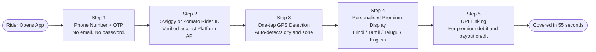

No English literacy required. No documents. Works on any 4G Android phone. Feels identical to signing up for PhonePe.

**Scenario — Ravi's onboarding:** Phone + OTP → Swiggy rider ID → GPS detects Tambaram automatically → Sees: *"Your premium this week: ₹67. Covers: Heavy rain, Extreme heat, AQI hazard, App outage, Restaurant zone closure, Dense fog."* → Links PhonePe UPI. **Total: 55 seconds.**

### 3.2 Weekly Policy Lifecycle

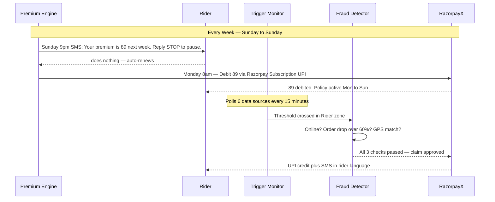

### 3.3 Claim Flow — Zero Touch

The rider **never files a claim.** The rider **never opens the app** during a disruption. The money arrives with an SMS explaining exactly what happened and why.

---

## 4. Weekly Premium Model

> **Weekly Pricing Constraint Met:** All premiums and payouts are structured on a strictly weekly basis (Monday–Sunday), aligned with the gig worker earnings cycle.

### The Premium Calculation Engine

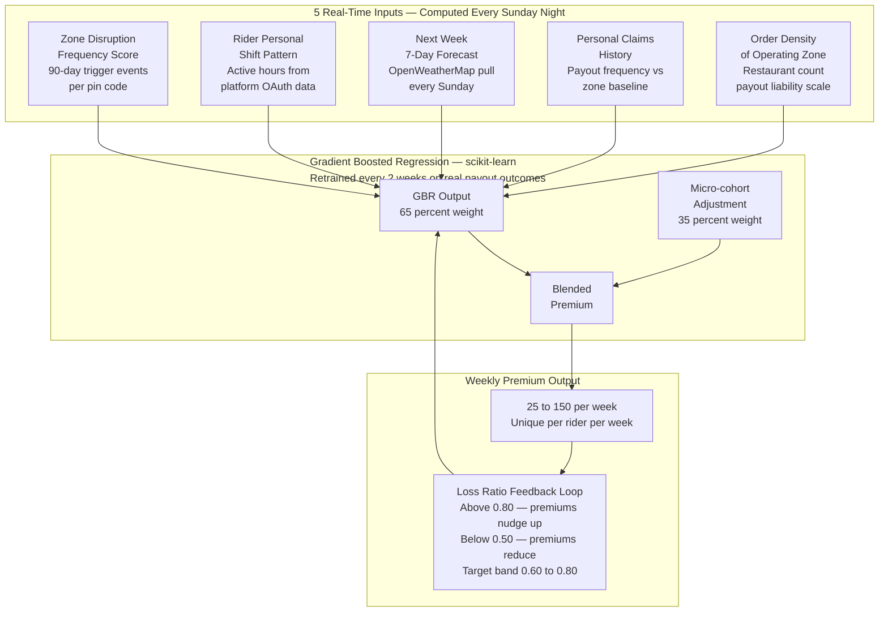

### Premium Example — Two Riders, Same City, Different Risk

| | Priya Kumar | Rohan Mehta |
|---|---|---|
| Zone | Andheri West, Mumbai | Bandra, Mumbai |
| Shift | 11am – 4pm (peak rain hours) | 6pm – 11pm |
| Zone rain risk | High (6 flood events / 90 days) | Low (2 events / 90 days) |
| Forecast | 3 rain days predicted | 1 rain day predicted |
| Cohort adjustment | +14% (Andheri monsoon cohort) | −8% (Bandra evening cohort) |
| **Weekly Premium** | **₹118** | **₹44** |

### Weekly Policy Structure

- **Coverage period:** Monday 00:00 to Sunday 23:59
- **Premium range:** ₹25 – ₹150/week
- **Maximum weekly payout:** Capped at 5 days to protect pool sustainability
- **Auto-renewal:** Every Monday 8am via Razorpay Subscription UPI auto-debit
- **Pause option:** Reply STOP before Sunday midnight to skip the coming week

---

## 5. Micro-Cohort Actuarial Pricing

> **Novel Feature — No other team will have this layer.**

Every other hackathon team will use 2–3 fixed tiers. We go further: on top of the individual GBR model, every rider belongs to a **micro-cohort** — a cluster of riders sharing the same zone, shift window, and season. The cohort's pooled loss history corrects for sparse individual data, especially for riders with under 4 weeks on platform. This is how real actuarial pricing works.

```mermaid
flowchart LR
    subgraph CLUSTER["k-means Clustering — every Sunday"]
        direction TB
        K1["Zone\npin code"]
        K2["Shift Window\nmorning / evening / night"]
        K3["Season\nmonsoon / summer / winter / dry"]
    end

    subgraph COHORTS["Micro-Cohort Examples"]
        direction TB
        C1["Tambaram evening monsoon\n143 riders · Loss rate 0.74\n+18 percent over base · 98 to 118"]
        C2["Koramangala night dry\n89 riders · Loss rate 0.31\n-22 percent under base · 28 to 44"]
        C3["Rohini morning summer\n211 riders · Loss rate 0.81\n+26 percent over base · 108 to 134"]
        C4["Bandra evening year-round\n178 riders · Loss rate 0.56\nNeutral · 52 to 71"]
    end

    subgraph FORMULA["Blending Formula"]
        F1["Established rider 4+ weeks\n0.65 x GBR output\n+ 0.35 x cohort rate"]
        F2["New rider under 4 weeks\n0.30 x GBR output\n+ 0.70 x cohort rate"]
    end

    CLUSTER --> COHORTS --> FORMULA
```

### Micro-Cohort Reference Table

| Micro-Cohort | Riders | 90-day Avg Loss Events | Cohort Loss Rate | Adjustment | Final Premium Range |
|---|---|---|---|---|---|
| Tambaram · evening · monsoon | 143 | 8.2 rain · 0 heat · 1.1 outage | High — 0.74 | +18% over base | ₹98 – ₹118 |
| Koramangala · night · dry | 89 | 0.4 rain · 0 heat · 2.1 fog | Low — 0.31 | −22% under base | ₹28 – ₹44 |
| Rohini · morning · summer | 211 | 0.6 rain · 11.3 heat · 0.9 outage | High — 0.81 | +26% over base | ₹108 – ₹134 |
| Bandra · evening · year-round | 178 | 3.1 rain · 1.2 heat · 1.8 outage · 0.4 FSSAI | Medium — 0.56 | Neutral | ₹52 – ₹71 |

**Formula:** `Final premium = 0.65 × individual GBR output + 0.35 × cohort loss rate adjustment`
For riders with < 4 weeks history: `0.30 × individual + 0.70 × cohort` until baseline is established.
Cohort membership recalculated every Sunday using k-means on zone, shift window, and season.

---

## 6. Parametric Triggers

We insure **income lost**, not the cost of external events. Six triggers cover the full range of disruptions that cause verifiable, objective income loss for food delivery riders.

| Trigger | Threshold | Data Source | Payout (Basic) | Payout (Full) |
|---|---|---|---|---|
| 🌧️ Heavy Rain | ≥ 64.5 mm/day | IMD / OpenWeatherMap | ₹300/day | ₹600/day |
| 🌡️ Extreme Heat | ≥ 45°C or Heat Index ≥ 41°C for 2hrs | IMD Heatwave Alert | ₹400/day | ₹700/day |
| 🏭 AQI Hazard | AQI ≥ 300 (Very Poor) | CPCB Sameer API | — | ₹400/day |
| 📵 Platform Outage | App down ≥ 30 mins | Downdetector + Status Page | ₹300/day | ₹500/day |
| 🏪 FSSAI Zone Closure | Mass restaurant closure in rider's pin code | FSSAI Public DB | — | ₹400/day |
| 🌫️ Dense Fog | Visibility < 50m | IMD Fog Alert (North India, Nov–Feb) | — | ₹300/day |

### Trigger Scenarios

**🌧️ Heavy Rain — Mumbai Monsoon:**
Aug 14, 3:15pm. IMD records 78mm in Andheri West. Detected via OpenWeatherMap at 3:30pm. Rider Priya: 9 orders normally 3–6pm, today only 2 (78% drop). GPS confirms zone. Fraud check passes. **3:48pm → ₹600 credited. Priya was sheltering from rain when the money arrived.**

**🏪 FSSAI Zone Closure — Hyderabad (World First):**
A Tuesday afternoon, clear weather, no other disruptions. FSSAI seals 11 restaurants in Kondapur. Rider Venkat Rao in that zone: normally 8–10 orders, only 1 between 2–5pm (88% drop). GPS confirms. Zero weather events. Platform working normally. **4:30pm → ₹400 credited. The only insurance product in the world that paid for this.**

**📵 Platform Outage — Nationwide AWS Failure:**
Documented Swiggy outage — 85–88% of users affected. Downdetector spike at 7:42pm. Outage persists 47 minutes. 1,247 eligible subscribers confirmed zero orders during window. **8:34pm → ₹3.74 lakh disbursed to 1,247 riders with zero human review.**

---

## 7. AI/ML Integration

### 7.1 Dynamic Premium — Gradient Boosted Regression + Micro-Cohort Blending

`GradientBoostingRegressor` (scikit-learn) trained on historical disruption data and payout outcomes. Outputs a base premium per rider per week. Blended with micro-cohort loss rate (35% weight for established riders, 70% for new riders). Retrained every 2 weeks on real payout outcomes — a continuously self-improving pricing engine.

**Self-correcting loss ratio loop:** The admin dashboard tracks live loss ratio (payouts ÷ premiums). If it drifts above 0.80 or below 0.50, the model automatically adjusts next week's premiums for affected zones. The AI is genuinely learning — not a static formula.

### 7.2 Fraud Detection — Isolation Forest Anomaly Scoring

`IsolationForest` builds a personal behavioral baseline for each rider over their first 4 weeks: typical online hours, orders per hour by time slot, GPS movement patterns, operating zones. Every payout request is scored 0–1 against that baseline. Full decision tree in Section 8.

### 7.3 Basis Risk Fallback Detection

The fundamental weakness of parametric insurance is **basis risk** — income lost when no formal trigger fires. Our fallback layer:
- Continuously compares **expected earnings** (30-day history) vs **actual platform earnings**
- If a significant weekly drop is detected with no trigger fired → flags potential missed payout
- Runs 3-point verification → if valid → auto-pays

No existing parametric product solves this. We do.

### 7.4 Work Optimisation — Proactive Income Intelligence

Using shift data, zone demand, and disruption forecasts, EarnSecure surfaces plain-language suggestions in the rider's language:

> *"Best time to work tomorrow: 6 PM – 9 PM. High order demand expected in your zone."*
> *"Heavy rain expected 2–5 PM tomorrow. You're covered if it affects your earnings."*

---

## 8. Fraud Detection Architecture

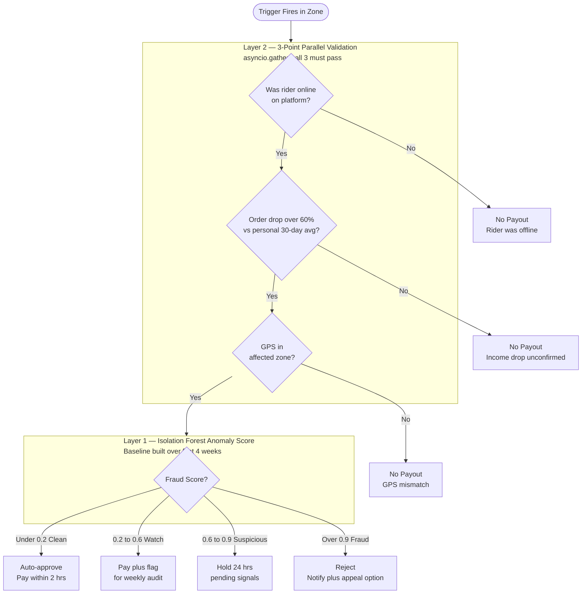

**Layer 3 — Duplicate Prevention:** 1 Rider ID + 1 Aadhaar-linked UPI + 1 device fingerprint = 1 account. Hard rule. Two accounts from same hardware → both frozen pending review.

**Layer 4 — Shared Address Edge Case:** Four riders from the same apartment all claim on a rain day. Surface appearance: syndicate fraud. Our system checks: each has unique Rider ID with 6-month delivery history + independent order drop confirmed by platform data. **All four get paid.** Shared housing is not fraud. Four 2-week-old accounts at same address → all four flagged.

---

## 9. Payout Processing

### Trigger to UPI Credit Pipeline

```mermaid
gantt
    title EarnSecure Payout Pipeline vs Industry Standard
    dateFormat  mm
    axisFormat  T+%M min

    section EarnSecure — target under 2 hrs 15 min
    Threshold detected 15-min poller         :milestone, m1, 00, 0m
    Identify subscribers in zone             :a1, 00, 15m
    3-point fraud check asyncio parallel     :a2, 15, 3m
    Claim approved sent to RazorpayX         :a3, 18, 2m
    UPI credit confirmed                     :a4, 20, 10m
    SMS sent in rider language               :milestone, m2, 30, 0m

    section Industry Standard — SEWA
    Manual claim process begins              :crit, b1, 00, 30m
    Weeks of manual processing               :crit, b2, 30, 30m
```

**Maximum total time: under 2 hours 15 min from disruption start**
**Industry benchmark (SEWA): 6–8 weeks**

### Transparency — Payout SMS

Every payout includes a plain-language explanation in the rider's language:
> *"EarnSecure: ₹600 credited. Reason: Rainfall 78mm (threshold: 64.5mm). Your orders dropped 72% in your zone 3–6 PM. Payout auto-approved. Check your UPI."*

---

## 10. Analytics Dashboards

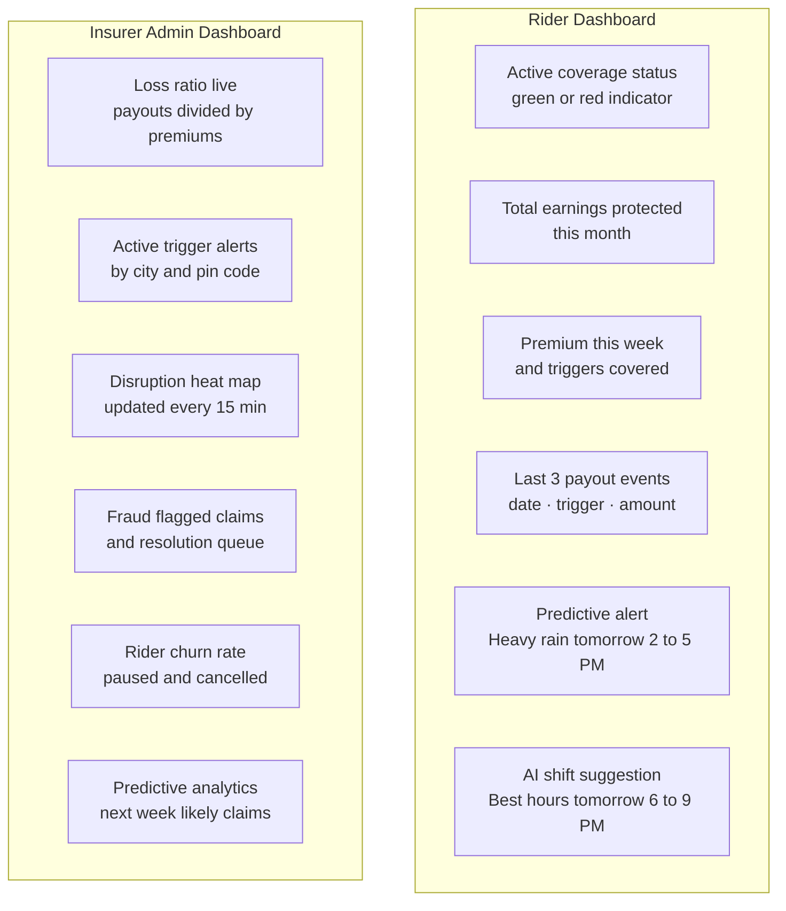

The **loss ratio** is the critical admin metric. If the AI premium model is working correctly, it stays between **0.60 and 0.80** — meaning we pay out 60–80 paise per rupee collected. A live loss ratio within this band during the demo is the proof that our dynamic pricing model genuinely works.

---

## 11. IRDAI Regulatory Compliance

> **Novel Feature — IRDAI compliance built in from Day 1, not bolted on.**

IRDAI mandates a **15-day maximum claim resolution TAT** for all registered insurers. EarnSecure beats this by an order of magnitude.

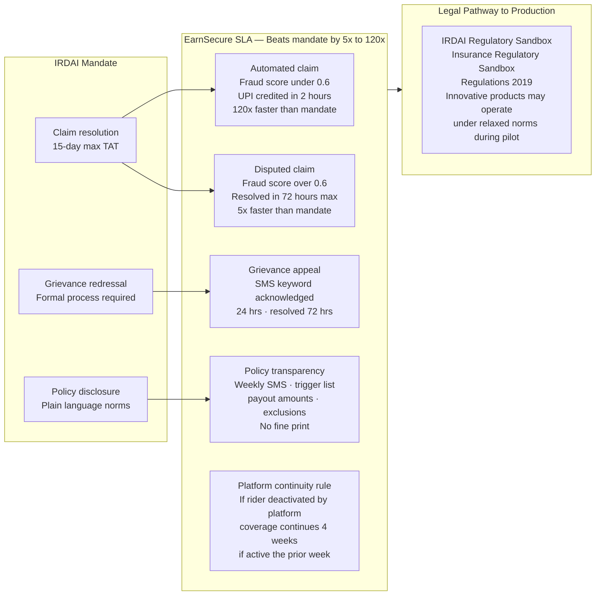

### IRDAI SLA Summary

| Scenario | IRDAI Mandate | EarnSecure SLA | Speed Advantage |
|---|---|---|---|
| Automated claim (score < 0.6) | 15 days | **2 hours** | 120× faster |
| Disputed claim (score > 0.6) | 15 days | **72 hours** | 5× faster |
| Grievance appeal | Formal process required | **24hr ack · 72hr resolution** | Built-in |
| Policy disclosure | Required | **Weekly SMS in rider's language** | Proactive |
| Platform deactivation | Not addressed | **4-week coverage continuity** | World first |

---

## 12. Competitive Landscape

### Full Comparison Table

| Feature | **EarnSecure** | Zomato/Swiggy | SEWA Parametric | PM-JAY | Generic Micro-insurance |
|---|---|---|---|---|---|
| Income loss covered | ✅ 6 triggers | ❌ Accident only | ⚠️ Heat partial | ❌ Health only | ⚠️ Fixed events |
| Parametric trigger | ✅ Fully automated | ❌ Manual claims | ⚠️ Partial | ❌ None | ❌ Self-report |
| Payout speed | ✅ **< 2 hours** | ❌ Days to weeks | ❌ 6–8 weeks | ❌ Weeks | ⚠️ 3–7 days |
| Weekly pricing | ✅ ₹25–₹150 | ❌ Rating-tied tier | ❌ Annual | ❌ Annual | ⚠️ Some |
| Platform-independent | ✅ Yes | ❌ Loses on deactivation | ✅ Yes | ✅ Yes | ⚠️ Some |
| FSSAI / outage trigger | ✅ **World first** | ❌ | ❌ | ❌ | ❌ |
| IRDAI compliance path | ✅ Sandbox pathway | ✅ Registered | ✅ NGO | ✅ Gov | ⚠️ Varies |
| Micro-cohort pricing | ✅ Novel | ❌ | ❌ | ❌ | ❌ |
| Basis risk solved | ✅ Fallback layer | ❌ | ❌ | ❌ | ❌ |

---

## 13. Platform Choice — Web vs Mobile

**Choice: React Progressive Web App (PWA)**

| Factor | Reasoning |
|---|---|
| No app store needed | Riders install via browser — no Play Store friction or review delays |
| Works offline | Service Worker caches key screens for low-connectivity moments |
| Works on any Android | No minimum OS version requirement |
| Identical UX to native | PWA on Android is indistinguishable from an installed app |
| Single codebase | Faster to build, test, and deploy across all platforms |

Our target users already use PhonePe and Hotstar — both offer PWA-like experiences. The onboarding is designed to feel identical.

---

## 14. Tech Stack

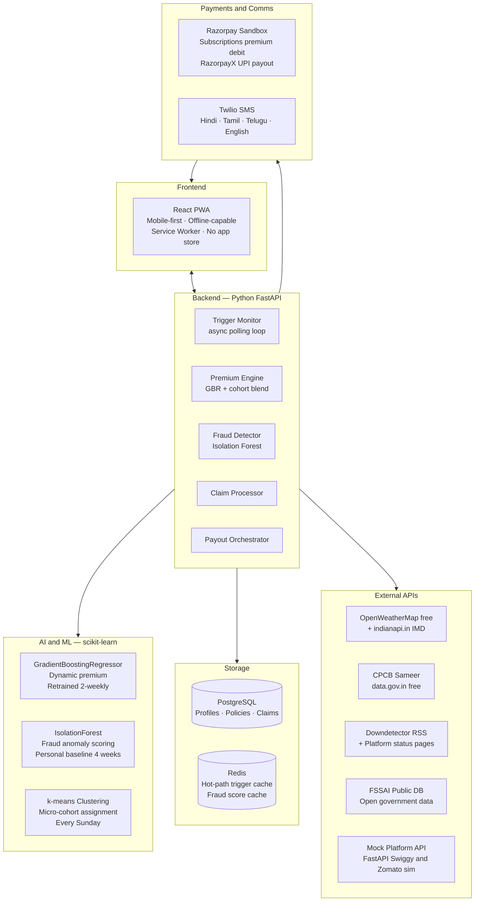

| Layer | Technology | Notes |
|---|---|---|
| **Frontend** | React PWA | Mobile-first, offline, no app store |
| **Backend** | Python FastAPI | `asyncio.gather` for parallel fraud checks |
| **AI/ML** | scikit-learn (GBR + IsolationForest + k-means) | Premium · Fraud · Cohort clustering |
| **Database** | PostgreSQL + Redis | Persistent records + hot-path cache |
| **Weather** | OpenWeatherMap (free) + indianapi.in IMD | Rain, temperature, 7-day forecast |
| **AQI** | CPCB Sameer via data.gov.in | Official government data, free |
| **Platform** | Mock FastAPI (Swiggy/Zomato simulation) | Problem statement permits simulated APIs |
| **Outage** | Downdetector RSS + platform status pages | Platform outage trigger |
| **FSSAI** | FSSAI public inspection database | Open government data |
| **Payments** | Razorpay Sandbox + RazorpayX | Weekly premium debit + instant UPI payout |
| **Notifications** | Twilio SMS (free tier) | 4 languages |
| **Hosting** | Render (free tier) | Demo deployment |

---

## 15. Development Plan

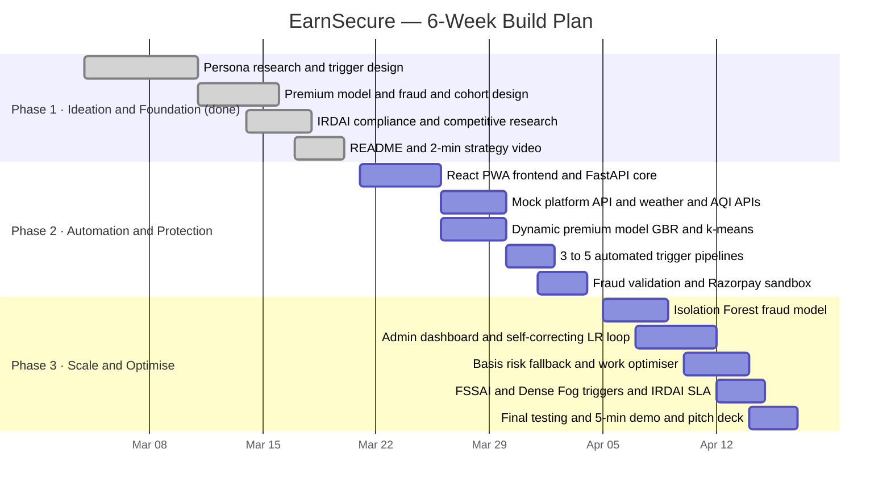

### Phase Checklist

**Phase 1 — Ideation & Foundation (March 4–20) ✅**
- [x] Persona selection and financial profiling (food delivery — Zomato/Swiggy)
- [x] 6 parametric triggers with thresholds, data sources, payout amounts
- [x] 5-step onboarding flow designed
- [x] Weekly premium model (GBR + 5 inputs + micro-cohort layer)
- [x] Fraud detection architecture (4 layers + Isolation Forest scoring)
- [x] IRDAI compliance framework and SLA design
- [x] Competitive landscape analysis
- [x] Tech stack selection
- [x] This README + 2-minute strategy video

**Phase 2 — Automation & Protection (March 21 – April 4)**
- [ ] React PWA (onboarding, policy view, rider dashboard)
- [ ] Python FastAPI backend with async trigger pipeline
- [ ] Mock Swiggy/Zomato platform API
- [ ] OpenWeatherMap + CPCB Sameer API integrations
- [ ] GBR premium model + k-means cohort clustering (mock training data)
- [ ] 3–5 automated trigger detection pipelines
- [ ] 3-point fraud validation with `asyncio.gather` parallel checks
- [ ] Razorpay Sandbox — premium debit + UPI payout
- [ ] Zero-touch claim pipeline end-to-end
- [ ] 2-minute demo video

**Phase 3 — Scale & Optimise (April 5–17)**
- [ ] Isolation Forest fraud anomaly model (4-week baseline per rider)
- [ ] Admin insurer dashboard (live loss ratio + self-correcting premium loop)
- [ ] Basis risk fallback detection layer
- [ ] Work optimisation AI suggestions for riders
- [ ] Predictive disruption alerts (7-day forecast SMS)
- [ ] FSSAI zone closure + Dense Fog triggers
- [ ] IRDAI SLA enforcement (2hr automated / 72hr disputed / continuity rule)
- [ ] Twilio multi-language SMS notifications
- [ ] Final integration testing and demo preparation
- [ ] 5-minute walkthrough demo video + final pitch deck (PDF)

---

## 16. What Makes EarnSecure Unique

### 1. 🏪 The FSSAI Trigger — Never Been Done Anywhere
No insurance product in the world covers income loss from a government food safety raid closing restaurants in a rider's zone. Data is publicly available. Perfectly parametric. Completely external to the rider. SEWA's researchers called for expansion to new trigger types — we answered with a trigger they never imagined.

### 2. 📵 Platform App Outage as a Parametric Trigger
When Zomato or Swiggy goes down due to an AWS failure, every active rider earns zero. No insurer on earth covers platform outage for gig workers. The platform's own status page confirms it. Zero ambiguity for fraud.

### 3. 🧮 Micro-Cohort Actuarial Pricing
Every other team will have fixed tiers (₹39/₹69/₹99). We run k-means clustering every Sunday to assign each rider to a micro-cohort (zone + shift + season). Cohort loss data blends with individual GBR output at 65/35 for established riders, 30/70 for new ones. Real actuarial science — no other team will have this.

### 4. ⚡ 2-Hour Payout vs 6-Week Industry Standard
SEWA takes 6–8 weeks to pay out manually. We pay in under 2 hours. For a rider who lost ₹700 in a heatwave and needs petrol money to get home, 6 weeks is not insurance. It is a historical footnote.

### 5. 🔄 Self-Correcting Loss Ratio Loop
The premium model doesn't just calculate — it learns. Live loss ratio on the admin dashboard. Drifts above 0.80 → premiums nudge up for affected zones. Falls below 0.50 → premiums reduce. A static formula with a dynamic label is not this.

### 6. 🧩 Basis Risk Solved
We detect income loss even when no formal trigger fires — comparing expected vs actual earnings using 30-day history. No other parametric product addresses the fundamental structural weakness of parametric insurance.

### 7. ⚖️ IRDAI Compliance from Day 1
Automated claims in 2 hours, disputed in 72 hours — both beating IRDAI's 15-day TAT mandate. Platform continuity rule protects riders deactivated during strikes. IRDAI Regulatory Sandbox is the legal pathway to production.

### 8. 🔓 Financial Independence from the Platform
When 150 Blinkit riders were blocked from the app for protesting in 43°C heat, they lost their income and their platform-tied insurance simultaneously. With EarnSecure, a rider who goes on strike, refuses unsafe work, or gets deactivated still has income protection — **because we are not Swiggy.**

---

## Hackathon Constraint Compliance

| Constraint | Status | Implementation |
|---|---|---|
| ✅ Weekly pricing model | Met | Premiums calculated and charged weekly (Mon–Sun); auto-debit Monday 8am |
| ✅ Income loss coverage only | Met | Pays lost wages only — zero health, life, accident, or vehicle repair payouts |
| ✅ Delivery partner persona | Met | Food delivery riders (Zomato/Swiggy) — specific sub-category with justification |
| ✅ Parametric automation | Met | 6 triggers: real-time monitoring → auto-claim → instant payout, zero touch |
| ✅ AI/ML integration | Met | GBR premium + IsolationForest fraud + k-means cohort + basis risk fallback |
| ✅ Fraud detection | Met | 4-layer system: anomaly scoring, 3-point validation, duplicate prevention, edge cases |
| ✅ Mock/free APIs acceptable | Met | OpenWeatherMap (free), CPCB (free), platform (mock), Razorpay (sandbox) |

---

*EarnSecure — Guidewire DEVTrails 2026 — University Hackathon*
*Phase 1 Submission | March 2026*
